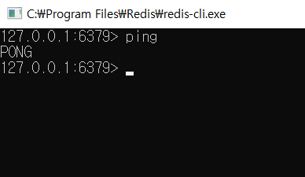
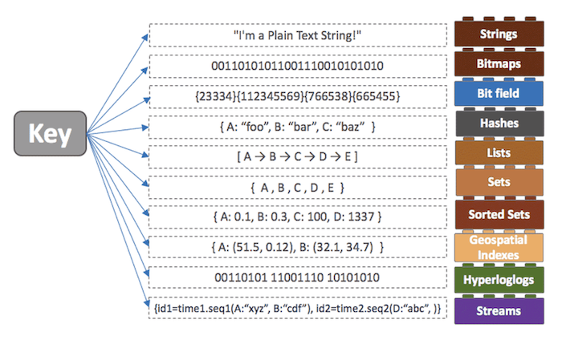
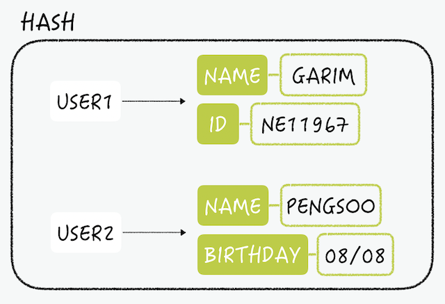
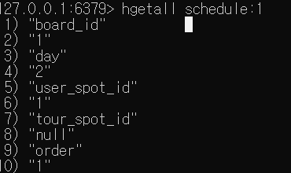
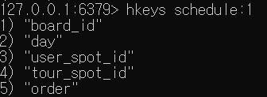
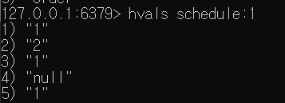

### :books: Redis

[redis 공식](https://redis.io/)


#### :book: 설치

https://github.com/microsoftarchive/redis/releases 에서 다운

작업관리자 > 서비스 에서 설치 확인 후 설치 폴더로 이동 > redis-cli.exe 실행




#### :book: 명령어

####  

| 명령어                  | 설명                                                         |
| ----------------------- | ------------------------------------------------------------ |
| set key value           | key, value 저장                                              |
| mset key value          | 여려 개의 key, value 한꺼번에 저장                           |
| setex key seconds value | key, value, second(소멸시간) 저장                            |
|                         |                                                              |
| keys *                  | 현재 저장된 모든 키값 확인(사용X)                            |
| get key                 | value 가져오기                                               |
| mget key [key...]       | 여러 개의 key에 해당하는 value 한번에 가져오기               |
| ttl key                 | key의 만료시간을 초단위로(-1 : 만료시간 없음, -2 : 데이터 없음) |
| pttl key                | key의 만료시간 밀리초단위로                                  |
| type key                | 해당 key의 value 타입 확인                                   |
|                         |                                                              |
| del key                 | key 삭제                                                     |
| del key [key...]        | 해당 key들 삭제                                              |
| rename key newKey       | key 이름 변경                                                |
| expire key seconds      | 해당 키 값의 만료 시간 설정                                  |
|                         |                                                              |
| randomkay               | random한 key 반환                                            |
| ping                    | 연결 여부 확인                                               |
| dbsize                  | 현재 사용중인 db의 key 갯수 리턴                             |
| flushall                | 레디스 서버의 모든 데이터 삭제                               |
| flushdb                 | 현재 사용중인 db의 모든 데이터 삭제                          |


#### :book: springboot와 연동

build.gradle > dependencies

```
implementation 'org.springframework.boot:spring-boot-starter-data-redis'
```

추가 후 빌드

application.properties

```
# redis
spring.redis.host=localhost
spring.redis.port=6379
```

추가 (비밀번호를 설정했을 경우 `password` 추가)


#### :book: data type

https://redis.io/topics/data-types

[redis 데이터 타입](https://meetup.toast.com/posts/224)



##### HASH




---


#### :book: 간단한 GET SET 구현

```java
package com.ssafy.service;

import org.springframework.beans.factory.annotation.Autowired;
import org.springframework.data.redis.core.StringRedisTemplate;
import org.springframework.data.redis.core.ValueOperations;
import org.springframework.stereotype.Service;

@Service
public class RedisSampleService {

	@Autowired
	private StringRedisTemplate stringRedisTemplate;
	
	public void getRedisStringValue(String key) {
		
		ValueOperations<String, String> stringValueOperations = stringRedisTemplate.opsForValue();
		System.out.println("Redis key: " + key);
		System.out.println("Redis value: " + stringValueOperations.get(key));
	}
	
	public void setRedisStringValue(String key, String value) {
		ValueOperations<String, String> stringValueOperations = stringRedisTemplate.opsForValue();
		stringValueOperations.set(key, value);
		System.out.println("Redis key: " + key);
		System.out.println("Redis value: " + stringValueOperations.get(key));
	}
}
```

```
package com.ssafy.service;

import org.springframework.beans.factory.annotation.Autowired;
import org.springframework.data.redis.core.StringRedisTemplate;
import org.springframework.data.redis.core.ValueOperations;
import org.springframework.stereotype.Service;

@Service
public class RedisSampleService {

	@Autowired
	private StringRedisTemplate stringRedisTemplate;
	
	public void getRedisStringValue(String key) {
		
		ValueOperations<String, String> stringValueOperations = stringRedisTemplate.opsForValue();
		System.out.println("Redis key: " + key);
		System.out.println("Redis value: " + stringValueOperations.get(key));
	}
	
	public void setRedisStringValue(String key, String value) {
		ValueOperations<String, String> stringValueOperations = stringRedisTemplate.opsForValue();
		stringValueOperations.set(key, value);
		System.out.println("Redis key: " + key);
		System.out.println("Redis value: " + stringValueOperations.get(key));
	}
}
```


#### :book: hash

참고 https://minholee93.tistory.com/entry/Redis-CRUD-with-Spring-Boot-1


##### Schedule Table (일정)

schedule_id (pk)

schedule_board_id (fk)

schedule_day(1~3일차)

schedule_user_spot_id(fk)

schedule_tour_spot_id(fk) → 지역 행정번호 뽑아서 지역 알아낼 수있음 가장 많이 포함된 지역으로 추천가능

schedule_order

schedule_additional   // 비고


Schedule

id:1 board_id:1 day:2 user_spot_id: 1 tour_spot_id: null order: 3


##### SET

```
hmset schedule:1 board_id 1 day 2 user_spot_id 1 tour_spot_id null order 1
```

version 4 이상부터는 hset으로 가능하고 hset 을 사용하도록 권장


##### GET

```
hget schedule:1 day
```


##### GET ALL




##### GET ALL KEYS




##### GET ALL VALUE




---

```java
package com.ssafy.tourtogether.db.entity;

import java.io.Serializable;

import javax.persistence.Id;

import org.springframework.data.redis.core.RedisHash;

import lombok.AllArgsConstructor;
import lombok.Getter;
import lombok.NoArgsConstructor;

@Getter
@NoArgsConstructor
@AllArgsConstructor
@RedisHash("schedule")
public class Schedule implements Serializable {
	
	@Id
	private String id;
	
	private Integer scheduleId;
	
	private Integer boardId;
	
	private int day;

}
```

```java
package com.ssafy.tourtogether.db.repository;

import java.util.Map;

import com.ssafy.tourtogether.db.entity.Schedule;

public interface RedisScheduleRepository {

	void save(Schedule schedule);
	Map<String, Schedule> findAll();
	Schedule findById(String id);
	void update(Schedule schedule);
	void delete(Schedule id);

}
```

```java
package com.ssafy.tourtogether.db.repository;

import java.util.Map;

import org.springframework.beans.factory.annotation.Autowired;
import org.springframework.data.redis.core.HashOperations;
import org.springframework.data.redis.core.RedisTemplate;
import org.springframework.stereotype.Repository;

import com.ssafy.tourtogether.db.entity.Schedule;

@Repository
public class RedisScheduleRepositorySupport implements RedisScheduleRepository{
	
	@Autowired
	private RedisTemplate<String, Schedule> redisTemplate;

	private HashOperations hashOperations;
	
	public RedisScheduleRepositorySupport(RedisTemplate<String, Schedule> redisTemplate) {
		this.redisTemplate = redisTemplate;
		hashOperations = redisTemplate.opsForHash();
	}

	@Override
	public void save(Schedule schedule) {
		hashOperations.put("SCHEDULE", schedule.getId(), schedule);		
	}

	@Override
	public Map<String, Schedule> findAll() {
		return hashOperations.entries("SCHEDULE");
	}

	@Override
	public Schedule findById(String id) {
		return (Schedule) hashOperations.get("SCHEDULE", id);
	}

	@Override
	public void update(Schedule schedule) {
		save(schedule);
	}

	@Override
	public void delete(Schedule id) {
		hashOperations.delete("SCHEDULE", id);
	}	
}
```

```java
package com.ssafy.tourtogether.api.controller;

import java.util.Map;

import org.springframework.beans.factory.annotation.Autowired;
import org.springframework.web.bind.annotation.GetMapping;
import org.springframework.web.bind.annotation.PathVariable;
import org.springframework.web.bind.annotation.PostMapping;
import org.springframework.web.bind.annotation.RequestMapping;
import org.springframework.web.bind.annotation.RestController;

import com.ssafy.tourtogether.db.repository.RedisScheduleRepository;
import com.ssafy.tourtogether.db.entity.Schedule;

@RestController
@RequestMapping("schedule/")
public class RedisScheduleController {

	@Autowired
	private RedisScheduleRepository redisScheduleRepository;

    @GetMapping("/add/{id}/{schedule_id}")
    public Schedule add(@PathVariable("id") final String id,
    					@PathVariable("schedule_id") final String scheduleId){
    	redisScheduleRepository.save(new Schedule(id, scheduleId, "1", 3));
        return redisScheduleRepository.findById(id);
    }
    
	@GetMapping("/all")
	public Map<String, Schedule> all(){
		return redisScheduleRepository.findAll();
	}
	
	@GetMapping("/{id}")
	public Schedule findById(@PathVariable("id") final String Id) {
		redisScheduleRepository.findById(Id);
		
		Schedule result;
		result = redisScheduleRepository.findById(Id);
		return result;
	}
}

```


#### :book: redis EC2 서버랑 연결

참고 : https://medium.com/@dlaudtjr07/redis-redis-%EA%B0%9C%EB%85%90-aws-ec2%ED%99%98%EA%B2%BD%EC%97%90%EC%84%9C-%EC%84%A4%EC%B9%98%ED%95%98%EA%B8%B0-a510cdb9731e


##### 패키지 최신 버전으로 업데이트

```bash
sudo apt-get update

sudo apt-get upgrade
```


##### redis 설치

```bash
sudo apt-get install redis-server
```


##### redis 버전 확인

```bash
redis-server — version
```


##### redis 설정

```bash
sudo vim /etc/redis/redis.conf
```

`bind 0.0.0.0 :: 1` 로 수정 : 모든 접속 허용

`port 6379` : 원하는 포트로 설정


##### redis 재시작

```bash
systemctl status redis-server.service

systemctl restart redis-server.service
```


##### :ambulance: 오류해결

*  bean error

https://bcp0109.tistory.com/329

*  415 error

https://thesse.tistory.com/141

https://grandj.tistory.com/197

